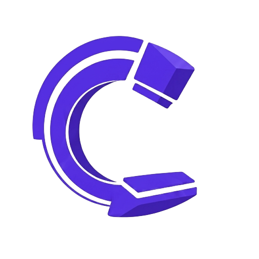

<!-- Improved compatibility of back to top link: See: https://github.com/othneildrew/Best-README-Template/pull/73 -->
<a id="readme-top"></a>

<!-- PROJECT SHIELDS -->
[![Contributors][contributors-shield]][contributors-url]

<!-- PROJECT LOGO -->
<br />
<div align="center">
  <a href="https://github.com/394-s26/X-Ray-Tech">
    
  </a>

<h3 align="center">X-Ray Tech</h3>

  <p align="center">
    Continuing-education credit tracking for Illinois x-ray technologists. It reads your CE certificates automatically and keeps your ARRT and IEMA license cycles in order.
  </br>
  </br>
    <a href="https://xraytech.web.app/">View Website</a>
    &middot;
    <a href="https://github.com/394-s26/X-Ray-Tech/issues/new?labels=bug">Report Bug</a>
    &middot;
    <a href="https://github.com/394-s26/X-Ray-Tech/issues/new?labels=enhancement">Request Feature</a>
  </p>
</div>


<!-- TABLE OF CONTENTS -->
<details>
  <summary>Table of Contents</summary>
  <ol>
    <li>
      <a href="#about-the-project">About The Project</a>
      <ul>
        <li><a href="#key-features">Key Features</a></li>
        <li><a href="#built-with">Built With</a></li>
      </ul>
    </li>
    <li>
      <a href="#getting-started">Getting Started</a>
      <ul>
        <li><a href="#prerequisites">Prerequisites</a></li>
        <li><a href="#installation">Installation</a></li>
      </ul>
    </li>
    <li><a href="#usage">Usage</a></li>
    <li><a href="#license-ce-logic">License CE Logic</a></li>
    <li><a href="#project-structure">Project Structure</a></li>
    <li><a href="#contributing">Contributing</a></li>
    <li><a href="#team">Team</a></li>
    <li><a href="#acknowledgments">Acknowledgments</a></li>
  </ol>
</details>


<!-- ABOUT THE PROJECT -->
## About The Project

**X-Ray Tech** is a web application that helps Illinois x-ray technologists stay
compliant with their continuing-education (CE) requirements. Techs in Illinois
maintain **two separate credentials**, **ARRT** (national) and **IEMA** (state). Each
one demands **24 CE credits every 2 years**, but they run on different cycle windows,
deadlines, and crediting rules.

Tracking this by hand is error-prone. X-Ray Tech enables its users to upload certificates while automatically extracting its relevant details with free object capture recognition (OCR). Users can then apply these credits to their intended licenses.
X-Ray Tech even handles the tricky edge cases around birth-month windows, probation periods,
and single-use-per-license rules.

The app is live at **[xraytech.web.app](https://xraytech.web.app/)**. Create an
account to start tracking.

This project was built by Northwestern University students in **CS 394 Agile Software Engineering**.

### Key Features

#### Landing Page

The landing page introduces X-Ray Tech and explains how it helps Illinois x-ray
technologists stay compliant with their ARRT and IEMA continuing education. Visitors
can see what the app does and what it offers before committing to anything. From here
they can move straight into signing in or creating an account.

<p align="center">
  
</p>

#### Dashboard

The dashboard is the home base where a technologist sees their overall compliance at a
glance. It shows progress toward the 24 credit requirement for both ARRT and IEMA,
along with countdowns to the next cycle deadlines. Visual credit bars and donuts make
it easy to tell how many credits are still needed and how much time remains. From here
a user can jump into adding certificates, reviewing cycles, or managing their account.

<p align="center">
  
</p>

#### Add Certificates

Users add a certificate by uploading a photo or PDF, and the app reads it
automatically with OCR to pull out the course, date, category, and credit value. The
extracted details are shown for review so a user can confirm or correct anything before
saving. Certificates can still be saved when the image upload allowance is reached,
falling back to a placeholder without losing any data. Once saved, a certificate is
ready to be applied to the right license later.

<p align="center">
  
</p>

#### Certificate Reporting

Certificate reporting is where users apply their saved certificates to the current ARRT
and IEMA cycles. Each certificate appears as a toggle that counts or uncounts it toward
a license, making it simple to see exactly what is being credited. The app enforces the
single use per license rule while still allowing one certificate to count across one
ARRT and one IEMA cycle. This gives technologists full control over how their credits
are distributed.

<p align="center">
  
</p>

#### Browse Certificates

The browse page helps technologists discover new certifications they can complete to
earn more credits. Each option includes a short description so users understand what a
certification covers before pursuing it. This makes it easier to plan ahead and close
any remaining gap toward the 24 credit requirement. It turns compliance from a reactive
chore into something a user can actively work toward.

<p align="center">
  
</p>

#### View and Manage Team

Team management lets administrators oversee a group of technologists in one place. Users
can create a team or join an existing one with a shareable team code, and admins can
regenerate that code when needed. The view shows each member with their combined ARRT
and IEMA compliance status, so a manager can quickly spot who is falling behind. This
keeps an entire department on track without checking each person individually.

<p align="center">
  
</p>

#### Notifications

X-Ray Tech keeps users informed with both in-app and push notifications about upcoming
deadlines. A notification bell surfaces recent alerts, and desktop or mobile push
reminders reach users even when the app is closed. Reminders are timed around cycle
deadlines so a technologist never misses a reporting window. Users stay aware of what
needs attention without having to log in and check manually.

<p align="center">
  
  
</p>

#### Available Certificates

The available certificates page lets users browse and manage all of their certificates
organized by issuing agency. From here a technologist can review what they have on file
and open any certificate to see its full details.

<p align="center">
  
</p>

#### License Cycles

The license cycles view tracks ARRT and IEMA separately, each with its own anchor,
deadline, and crediting rules. Users can see exactly where each cycle stands and how
applied certificates count toward the 24 credit requirement.

<p align="center">
  
</p>

<p align="right">(<a href="#readme-top">back to top</a>)</p>

### Built With

* [![React][React.js]][React-url]
* [![TypeScript][TypeScript]][TypeScript-url]
* [![Vite][Vite.js]][Vite-url]
* [![Tailwind][Tailwind]][Tailwind-url]
* [![Firebase][Firebase]][Firebase-url]

It also leans on **Tesseract.js** and **PDF.js** for certificate OCR, **GSAP** for
animations, **React Router** for navigation, and **Python Cloud Functions** for
server-side certificate extraction.

<p align="right">(<a href="#readme-top">back to top</a>)</p>


<!-- GETTING STARTED -->
## Getting Started

Want to try it first? The hosted app is available at
[xraytech.web.app](https://xraytech.web.app/) with no setup required. To run a local
copy, follow these steps.

### Prerequisites

* **Node.js** (v18+) and **npm**
  ```sh
  npm install npm@latest -g
  ```
* A **Firebase project** with Firestore, Authentication, Storage, and Cloud Functions
  enabled.
* The **Firebase CLI** (used for local emulation and deployment)
  ```sh
  npm install -g firebase-tools
  ```

### Installation

1. Clone the repo
   ```sh
   git clone https://github.com/394-s26/X-Ray-Tech.git
   cd X-Ray-Tech
   ```
2. Install NPM packages
   ```sh
   npm install
   ```
3. Configure your Firebase environment variables. Copy the example file and fill in
   the values from your Firebase Console under **Project Settings > General > Your apps
   > Web app > SDK setup and configuration**.
   ```sh
   cp .env.example .env
   ```
   ```env
   VITE_FIREBASE_API_KEY=your-api-key
   VITE_FIREBASE_AUTH_DOMAIN=your-project.firebaseapp.com
   VITE_FIREBASE_PROJECT_ID=your-project-id
   VITE_FIREBASE_STORAGE_BUCKET=your-project.appspot.com
   VITE_FIREBASE_MESSAGING_SENDER_ID=your-sender-id
   VITE_FIREBASE_APP_ID=your-app-id
   ```
4. Start the development server
   ```sh
   npm run dev
   ```

<p align="right">(<a href="#readme-top">back to top</a>)</p>


<!-- USAGE EXAMPLES -->
## Usage

The project ships with these npm scripts.

| Command | Description |
|---|---|
| `npm run dev` | Start the Vite development server with HMR |
| `npm run build` | Type-check and build the production bundle to `dist/` |
| `npm run preview` | Preview the production build locally |
| `npm run lint` | Run ESLint over the project |

**Typical flow.** Sign in → complete account setup (birth month and accreditation date,
which anchor the ARRT and IEMA cycles) → upload a CE certificate → review the
OCR-extracted details → save. The credits land in the right license cycle(s)
automatically, and the dashboard shows progress toward the 24-credit requirement and
flags upcoming deadlines.

<p align="right">(<a href="#readme-top">back to top</a>)</p>


<!-- LICENSE CE LOGIC -->
## License CE Logic

The core domain logic for how ARRT and IEMA cycles differ lives in
[license_ce_logic.md](license_ce_logic.md). Here are the key differences at a glance.

| Rule | ARRT | IEMA |
|---|---|---|
| Cycle anchor | Birth month | Accreditation month |
| Final-month CEs count? | **No** | **Yes** (if reported by deadline) |
| Formal CE probation | 6 months, isolated points pool | None documented |
| Points required | 24 | 24 |
| Accepted CE category | A or A+ | A or A+ |
| Cert reuse within same license | Not allowed | Not allowed |
| Cert reuse across licenses | Allowed (one ARRT + one IEMA) | Allowed (one ARRT + one IEMA) |

<p align="right">(<a href="#readme-top">back to top</a>)</p>


<!-- PROJECT STRUCTURE -->
## Project Structure

```
/src
  /components    # React components, one per file
  /pages         # Route-level pages
  /hooks         # Custom React hooks
  /services      # Firebase & external API calls (OCR, parsing, cycle logic)
  /contexts      # React context providers (e.g. theme)
  /types         # TypeScript types and interfaces
  /utils         # Shared pure functions and helpers
  /styles        # Component- and page-level CSS (Tailwind @apply)
/functions        # Firebase Cloud Functions (TypeScript, for email, FCM, scheduled)
/functions-python # Python Cloud Functions (certificate extraction)
/design-system    # Design tokens and shared UI reference
/public           # Static assets (favicon, service worker, logos)
```

Conventions for this codebase are documented in
[.github/agent-instructions.md](.github/agent-instructions.md). All Firebase and
network calls live in `/src/services/`, components never import the Firebase SDK
directly, and the app uses a string-based permissions system.

<p align="right">(<a href="#readme-top">back to top</a>)</p>


<!-- CONTRIBUTING -->
## Contributing

Contributions are welcome. To propose a change, follow these steps.

1. Fork the Project
2. Create your Feature Branch (`git checkout -b feature/AmazingFeature`)
3. Commit your Changes (`git commit -m 'Add some AmazingFeature'`)
4. Push to the Branch (`git push origin feature/AmazingFeature`)
5. Open a Pull Request

Please make sure your code passes `npm run lint` and `npm run build` before opening a
PR.

### Top Contributors

<a href="https://github.com/394-s26/X-Ray-Tech/graphs/contributors">
  
</a>

<p align="right">(<a href="#readme-top">back to top</a>)</p>


<!-- TEAM -->
## Team

Built by the CS 394 X-Ray Tech team at Northwestern University.

- **Adnan Alhabian**
- **Yusuf Ozdemir**
- **Azan Malik**
- **Fiorelli Wong**
- **Aidan Zea**

Try the live app at [https://xraytech.web.app/](https://xraytech.web.app/)

Find the source on GitHub at [https://github.com/394-s26/X-Ray-Tech](https://github.com/394-s26/X-Ray-Tech)

<p align="right">(<a href="#readme-top">back to top</a>)</p>


<!-- ACKNOWLEDGMENTS -->
## Acknowledgments

* [CS 394 Agile Software Engineering](https://www.mccormick.northwestern.edu/computer-science/) at Northwestern University
* [ARRT, the American Registry of Radiologic Technologists](https://www.arrt.org)
* [IEMA, the Illinois Emergency Management Agency, Division of Nuclear Safety](https://iema.illinois.gov/)
* [Best-README-Template](https://github.com/othneildrew/Best-README-Template)

<p align="right">(<a href="#readme-top">back to top</a>)</p>


<!-- MARKDOWN LINKS & IMAGES -->
[contributors-shield]: https://img.shields.io/github/contributors/394-s26/X-Ray-Tech.svg?style=for-the-badge
[contributors-url]: https://github.com/394-s26/X-Ray-Tech/graphs/contributors
[forks-shield]: https://img.shields.io/github/forks/394-s26/X-Ray-Tech.svg?style=for-the-badge
[forks-url]: https://github.com/394-s26/X-Ray-Tech/network/members
[stars-shield]: https://img.shields.io/github/stars/394-s26/X-Ray-Tech.svg?style=for-the-badge
[stars-url]: https://github.com/394-s26/X-Ray-Tech/stargazers
[issues-shield]: https://img.shields.io/github/issues/394-s26/X-Ray-Tech.svg?style=for-the-badge
[issues-url]: https://github.com/394-s26/X-Ray-Tech/issues
[React.js]: https://img.shields.io/badge/React-20232A?style=for-the-badge&logo=react&logoColor=61DAFB
[React-url]: https://react.dev/
[TypeScript]: https://img.shields.io/badge/TypeScript-3178C6?style=for-the-badge&logo=typescript&logoColor=white
[TypeScript-url]: https://www.typescriptlang.org/
[Vite.js]: https://img.shields.io/badge/Vite-646CFF?style=for-the-badge&logo=vite&logoColor=white
[Vite-url]: https://vite.dev/
[Tailwind]: https://img.shields.io/badge/Tailwind_CSS-38B2AC?style=for-the-badge&logo=tailwind-css&logoColor=white
[Tailwind-url]: https://tailwindcss.com/
[Firebase]: https://img.shields.io/badge/Firebase-FFCA28?style=for-the-badge&logo=firebase&logoColor=black
[Firebase-url]: https://firebase.google.com/
